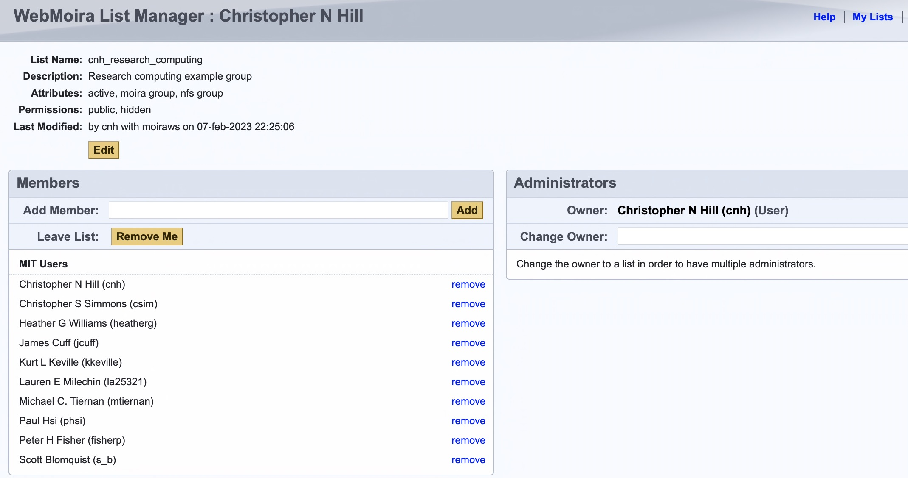

# Project Specific Filesystems

## Purchasing Storage

Additional project and lab storage can be purchased on ORCD shared clusters by individual
PI groups. This storage is mounted on the cluster and access to the storage is managed 
by the group through [MIT Web Moira](https://groups.mit.edu/webmoira/) (see [below](#managing-access-using-mit-web-moira) for details).

The options for storage are:

| Storage Type | Description | Encryption at Rest  | Backup  | Namespace |Notes | 
| ----------- | ----------- |----------- |----------- |----------- |----------- |
| Data | Frequent data access | Optional | No |  Limited | Day to day research storage, active projects, instrument data buffers, etc. |
| Compute (Coming Soon) | Very frequent data access | Optional | No | Limited | Very fast access, special needs, high IO |

Please note that all types of storage **are not backed up by default**.

Storage is charged at the start of each month. The first month is prorated by the number of days left in the current month. A purchase must be a minimum of 20 TiB and in increments of 20 TiB.

If you anticipate needing more than a few 100 TiB let us know when you request your storage. We may suggest purchasing a dedicated server for your lab.

For more information, including pricing, and to purchase storage please send an email to <orcd-help@mit.edu>. If you are purchasing storage please include the following in your request:

- The storage type (compute, data, or archival)
- Amount in TiB (20 TiB increments)
- Cost object
- The lab PI

## Managing access using MIT Web Moira

Individual group storage is configured so that access is limited to a set
of accounts belonging to a web moira list that is defined for the group
store. The owner and administrators of group storage can manage
access themselves, by modifying the membership of an associated moira list
under **https://groups.mit.edu/webmoira/list/[list_name]**. The name of the
list corresponds to a UNIX group name associated with the ORCD shared 
cluster storage. The naming scheme we use means this list name won't exactly match the UNIX group name you see on the cluster storage, but it will be similar.

If you are an admin of an ORCD group you will see that group listed under "Lists I Can Administer" when you log into [Web Moira](https://groups.mit.edu/webmoira/). Click on the group name to go to the group management page. We will also send you a direct link to your group management page when we create your group.

### Moira Web Interface Example

The figure below shows a screenshot of the web moira management page at
**https://groups.mit.edu/webmoira/list/cnh_research_computing** for a hypothetical
storage group named ``cnh_research_computing``. The interface provides a 
self-service mechanism for controlling access to any storage belonging to
this group. MIT account IDs can be added and 
removed as needed from this list by the storage access administrators.

