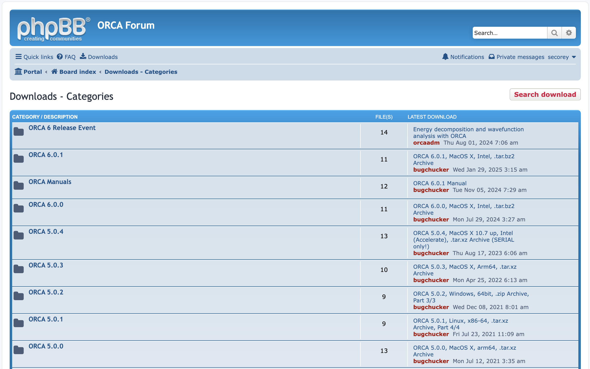
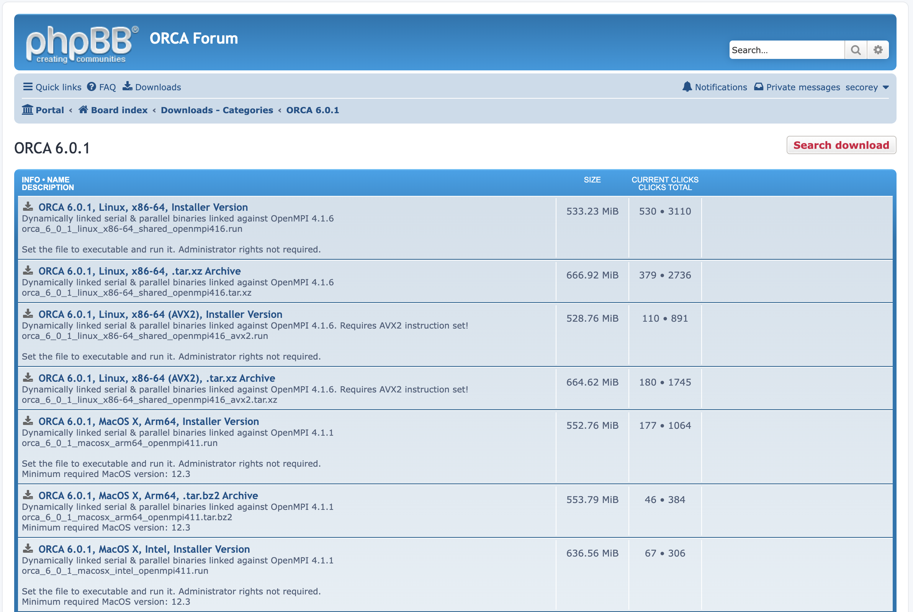
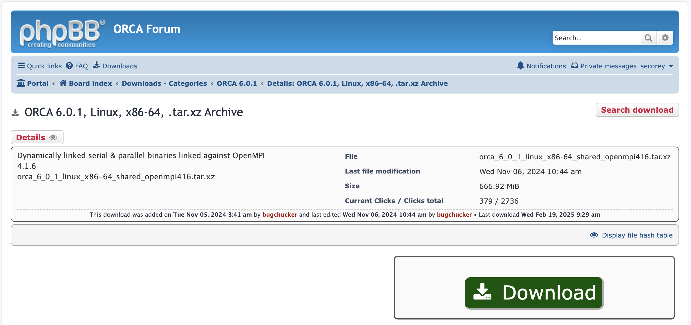

---
tags:
 - ORCA
 - Engaging
---

# Installing ORCA for Personal Use

ORCA is a quantum chemistry software package designed for computational
chemistry, featuring a wide range of methods including electronic structure
theory.

ORCA is a licensed software that is free for academic use, but it cannot be
transferred to third parties (per the ORCA EULA). So, we cannot install newer
versions system-wide. Users must create an account and install it personally.
Here are the steps to do so:

- Navigate to the [ORCA website](https://orcaforum.kofo.mpg.de/app.php/portal)
- Register for an account and login
- Click "Downloads" in the top bar


- Select the version of ORCA you want



- Select the "Linux, x86-64, .tar.xz Archive” version



- Click "Download"



- Upload the `.tar.xz` file to Engaging using `scp`:

```bash
scp /path/to/source/orca_6_0_1_linux_x86-64_shared_openmpi416.tar.xz $USER@orcd-login001.mit.edu:/path/to/destination
```

- On Engaging, extract the `tar.xz` file:

```bash
tar -xf orca_6_0_1_linux_x86-64_shared_openmpi416.tar.xz
```

- Add this version of ORCA to your path:

```bash
export PATH=/path/to/orca_6_0_1_linux_x86-64_shared_openmpi416:$PATH
```

## Running a Test Case

To see if our installation was successful, we can run a test case adapted from
the [ORCA 6.0 Tutorials](https://www.faccts.de/docs/orca/6.0/tutorials/first_steps/first_calc.html).

First, create an empty directory:

```bash
mkdir ~/orca_test
cd ~/orca_test
```

Next, create a test file:

```title="water.inp"
!HF DEF2-SVP
* xyz 0 1
O   0.0000   0.0000   0.0626
H  -0.7920   0.0000  -0.4973
H   0.7920   0.0000  -0.4973
*
```

Run `orca` on this file and save the output to another file:

```bash
orca water.inp > water.out
```

## Running ORCA with Multiple Processes

To truly take advantage of the resources available to you on a high performance
computing cluster, you can run ORCA in parallel. The version of ORCA we've
downloaded uses MPI to handle parallel computation. Since we already have MPI
installed on the cluster as a module, using it is pretty straightforward.

First, you will need to request adequate resources. Make sure the resources you
request match what you specify in your ORCA input file:

```bash
salloc -N 1 -n 4 -p mit_normal
```

!!! note
    While this example is using an interactive job, we recommend using a batch
    job for longer-running programs. See
    [here](../running-jobs/overview.md#running-jobs) for more information on
    running jobs.

When using ORCA with MPI, ORCA
[recommends](https://www.faccts.de/docs/orca/6.0/manual/contents/calling.html#calling-the-program-with-multiple-processes)
that you add MPI to your path and also add the paths to the ORCA and MPI
libraries to your `LD_LIBRARY_PATH` environment variable:

```bash
module load openmpi # Adds openmpi to $PATH
export LD_LIBRARY_PATH=/path/to/orca_6_0_1_linux_x86-64_shared_openmpi416/lib:$LD_LIBRARY_PATH
export LD_LIBRARY_PATH=/orcd/software/core/001/spack/pkg/openmpi/4.1.4/zahpnmk/lib:$LD_LIBRARY_PATH
```

!!! note
    This example is for Engaging Rocky 8 nodes. For Engaging CentOS 7 nodes or
    other clusters, you'll need to change the path to your OpenMPI library.

We will also need to edit our input file to specify the number of processes:

```title="water.inp"
!HF DEF2-SVP PAL4 # For 4 processes
* xyz 0 1
O   0.0000   0.0000   0.0626
H  -0.7920   0.0000  -0.4973
H   0.7920   0.0000  -0.4973
*
```

When we run ORCA with multiple processes, we need to use the full path to the
ORCA binary:

```bash
/path/to/orca_6_0_1_linux_x86-64_shared_openmpi416/orca water.inp > water.out
```
