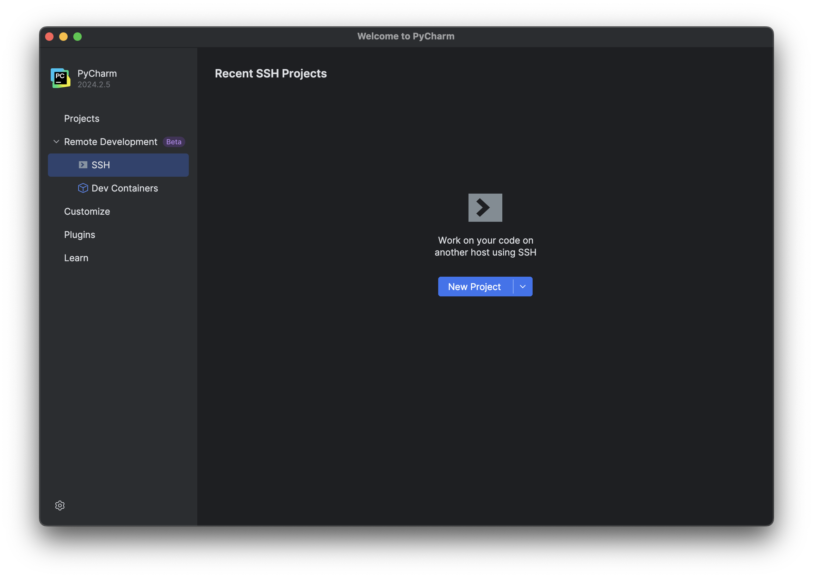
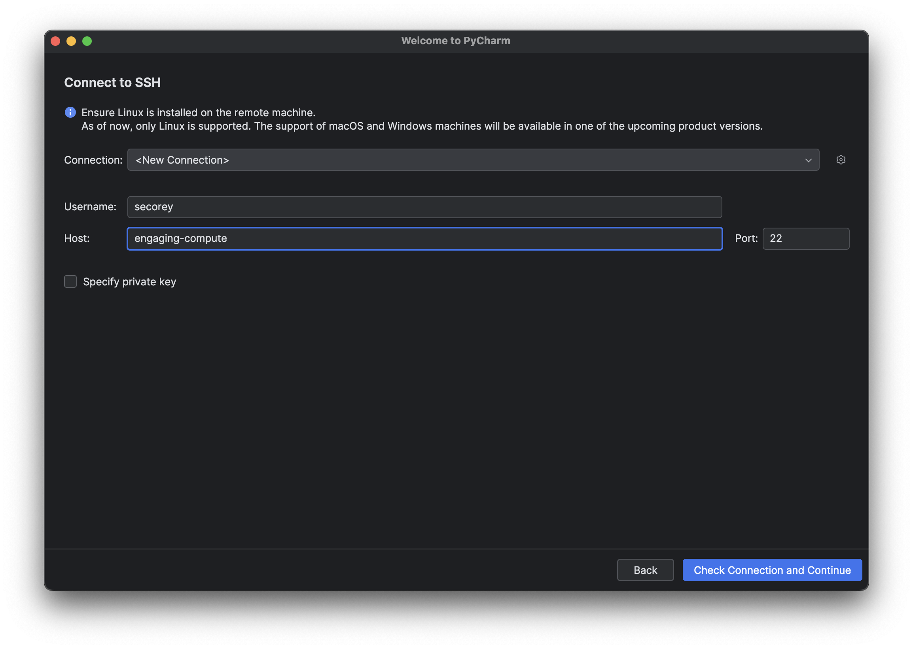
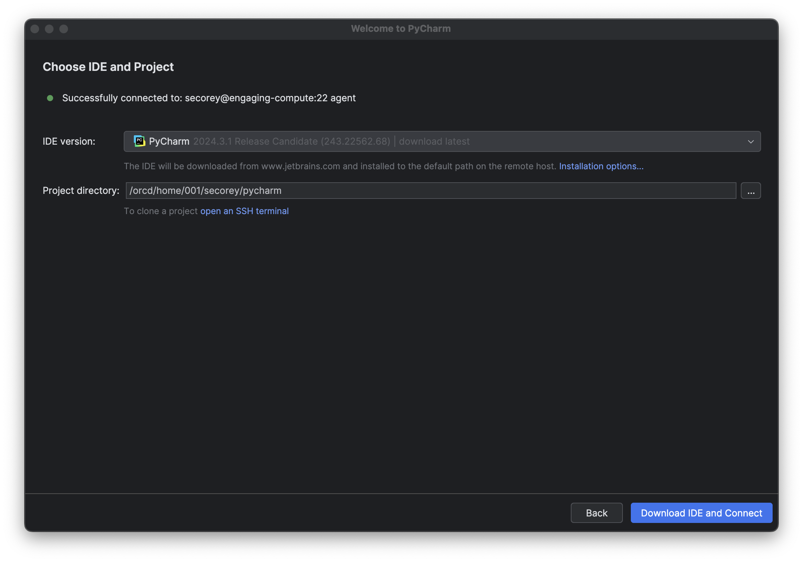

---
tags:
 - PyCharm
 - Howto Recipes
 - Best Practices
---

# Using PyCharm on an ORCD System

PyCharm provides an integrated development environment for users to edit their
Python code and has support for remote development via SSH. While we generally
recommend using [VS Code](vscode.md) due to its much broader set of features
while being free and open-source, some prefer the simplicity of PyCharm.
Furthermore, PyCharm has a free license for students and teachers.

To use PyCharm on the cluster, the setup is similar to [VS Code](vscode.md).
However, PyCharm uses a lot more memory and compute power to run, so it is
essential that you run it on a compute node. Trying to connect PyCharm to a
login node will probably not work.

!!! note
    To use PyCharm on a compute node, an SSH key is necessary. If you haven't
    set up SSH keys yet, refer to the
    [SSH Key Setup guide](../accessing-orcd/ssh-setup.md).

!!! note
    PyCharm is not available on SuperCloud because SuperCloud does not support
    [file locking](https://mit-supercloud.github.io/supercloud-docs/file-locking/).

## Requesting a Compute Node

To run PyCharm on a compute node, you first need to request an interactive job
with at least 4 cores on the cluster. PyCharm recommends using 4 cores so that the
application can run more quickly. Request more resources as required by your code.

```bash
salloc -N 1 -n 4 -p mit_normal
```

!!! note
    PyCharm is not supported on Centos7 nodes.

## Editing your SSH Config File

Once you are in the interactive session, make a note of the node you are running
on. We now want to edit our local SSH `config` file so that PyCharm can run on
that node. To do this, open the command line and locate your `config` file. It
is usually located in `~/.ssh/config`. Using your favorite editor, paste the
following (enter your username and the correct node number):

```yaml title="config"
Host engaging-compute
  User USERNAME
  HostName nodeXXXX
  ProxyJump orcd-login001.mit.edu
```

!!! note
    If you don't want to edit your `config` file every time you start up a
    PyCharm session, you can request a specific node each time you start an
    interactive session with the flag `--nodelist=nodeXXXX`. Just make sure that
    the node in your config file reflects the node that you're requesting.
    However, the node you're requesting may be unavailable, in which case you'll
    have to choose a different node and edit your `config` file anyway.

## Starting PyCharm

Currently, PyCharm does not work well with Duo authentication. To get around
this, connect to the [MIT VPN](https://ist.mit.edu/vpn) so that Duo is not
required.

Open PyCharm and click Remote Development > SSH on the left-hand side:



Create a new project and connect to SSH. Enter your username and host name (in
this case it's `engaging-compute`), then click "Check Connection and Continue":



This will open a new page where you will enter your project directory. Enter
the path to the directory on Engaging that you'd like to work in. You are likely
to get the most success if you point PyCharm to a blank directory (I've named
mine `pycharm` for now). Click "Download IDE and Connect":



## Troubleshooting

If you are still running into issues, try deleting the JetBrains cache in your
home directory on the cluster via the command line:

```bash
rm -r ~/.cache/JetBrains
```
