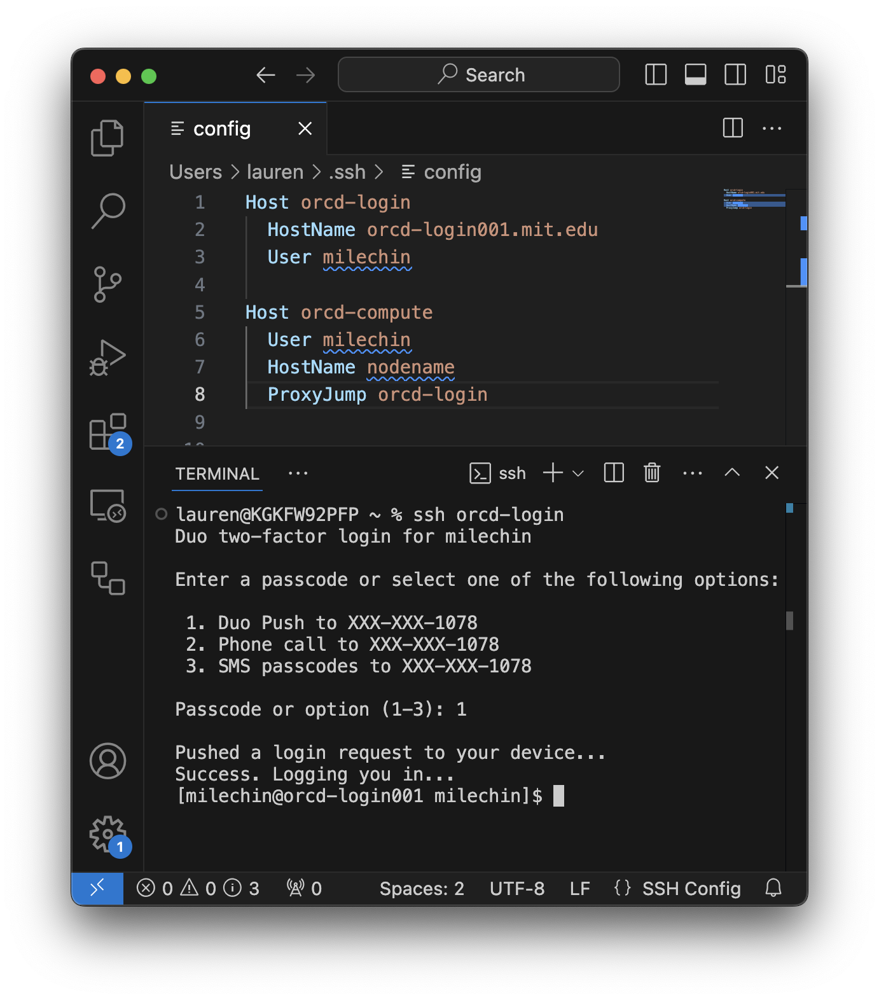
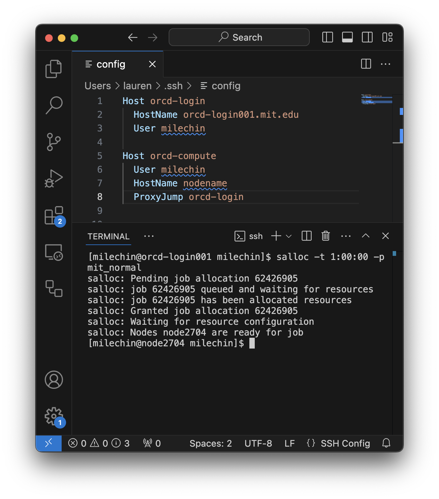
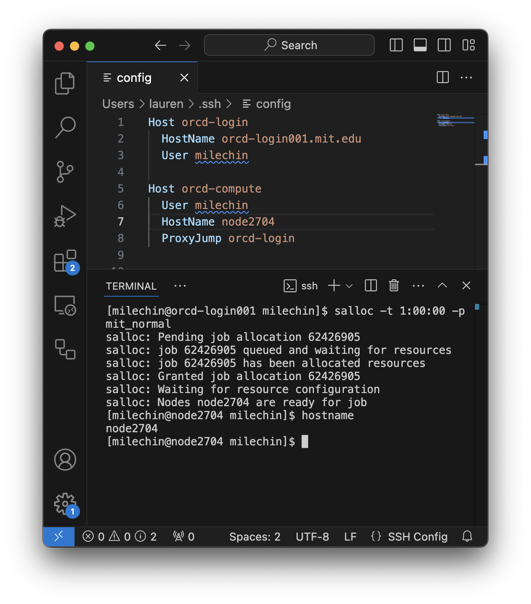
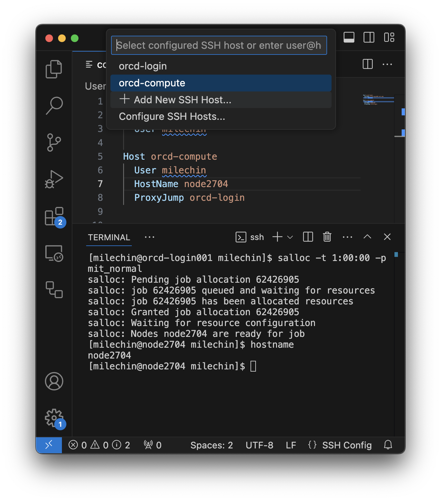

---
tags:
 - vscode
 - Howto Recipes
 - Best Practices
---
# Using VSCode on an ORCD System

VSCode is a convenient IDE for development, and one of its nicest features is its ability to run on a remote system using its RemoteSSH extension. This means you can have the VSCode window on your computer, while the files and anything you run will be on the remote system you are connected to.

Once you've installed the RemoteSSH extension this is fairly easy to set up. However, it is also very easy to set up in such a way that it is not only slow for you, but it also puts excess load on the login nodes and in turn slows things down for others on that node. Luckily, with a few extra steps you can run VSCode on a compute node where it can have more resources to run and won't impact others as much.

## Setting up your Config File

Click the "Open a Remote Window" button in the bottom left corner of your VSCode window (It is a small blue rectangle labeled with `><`). In the bar at the top of the page select "Connect to Host...", then "Configure SSH Hosts", and select first option, which will differ depending on your operating system. This will open your config file in a VSCode tab.

To run on a compute node you will need at least 2 entries in this file. The first will be a login node that you'll "jump" through and the second will be the compute node that is your final destination.

=== "Engaging"

    ```yaml title="config"
    Host orcd-login
      HostName orcd-login001.mit.edu
      User USERNAME

    Host orcd-compute
      User USERNAME
      HostName nodename
      ProxyJump orcd-login
    ```

    !!! note
        If you are using one of the login nodes that requires 2-Factor authentication be ready to receive your default 2-Factor prompt when you connect. If you do not respond right away the connection will time out.
    
    !!! note
        To use VSCode on a compute node, an SSH key is necessary. If you haven't set up SSH keys yet, refer to the [SSH Key Setup guide](../accessing-orcd/ssh-setup.md).

=== "Satori"

    ```yaml title="config"
    Host satori-login
      HostName satori-login-001.mit.edu
      User USERNAME

    Host satori-compute
      User USERNAME
      HostName nodename
      ProxyJump satori-login
    ```

    !!! note
        To use VSCode on a compute node, an SSH key is necessary. If you haven't set up SSH keys yet, refer to the [SSH Key Setup guide](../accessing-orcd/ssh-setup.md).

=== "Open Mind"

    ```yaml title="config"
    Host om-login
      HostName openmind7.mit.edu
      User USERNAME

    Host om-compute
      User USERNAME
      HostName nodename
      ProxyJump om-login
    ```

    !!! note
        To use VSCode on a compute node, an SSH key is necessary. If you haven't set up SSH keys yet, refer to the [SSH Key Setup guide](../accessing-orcd/ssh-setup.md).

Replace `USERNAME` with your username on the system you are connecting to. We will fill in "nodename" later.


## Starting your VSCode Session on a Compute Node

Each time you sit down to do remote work through VSCode you will have three steps:

1. Start an interactive job on the target system and note the name of the node your job is running on
2. Update your config file with the node name
3. Connect to the compute node using your updated config

We go through these steps in detail below.

### Start an Interactive Job

Open a terminal window and ssh into the login node. If you are not used to doing this you can open a terminal in VSCode and run:

=== "Engaging"

    ```bash
    ssh orcd-login
    ```

=== "Satori"

    ```bash
    ssh satori-login
    ```

=== "Open Mind"

    ```bash
    ssh om-login
    ```

Use the name you have used for the login `Host` in your config file if different than the one above. The example screenshot below shows logging into one of the Engaging login nodes with ssh in a VSCode terminal window.



Once you are logged in start an interactive session. If you are planning to only edit files a single core may be sufficient, but if you plan to run code or Jupyter Notebooks you may want to allocate more resources accordingly. Refer to the documentation for your system on how to request an interactive job:

=== "Engaging"

    [Engaging's Documentation for Running Jobs](https://orcd-docs.mit.edu/running-jobs/overview/)
    
=== "Satori"

    [Satori's Documentation for Running Jobs](https://mit-satori.github.io/satori-workload-manager-using-slurm.html)

=== "SuperCloud"

    [SuperCloud's Documentation for Running Jobs](https://supercloud.mit.edu/submitting-jobs)

=== "OpenMind"

    [OpenMind's Documentation for Running Jobs](https://github.mit.edu/MGHPCC/OpenMind/wiki/Getting-started#run)

Once your job has started you can run the `hostname` command to get the name of the node your interactive job is running on. You can also run the `squeue --me` command to list all your running jobs and get the hostname from the last column.

The screenshot below shows requesting a single interactive core for 1 hour on Engaging:



```bash
salloc -t 1:00:00 -p mit_normal
```

Note that the scheduler will also tell you which node you are allocated in its output. In this screenshot my node name is `node2704`.

### Update your Config File

Update the `HostName` of your compute node entry in your config file. If your config file is not open, follow the instructions [above](#setting-up-your-config-file) to open it again. Then replace whatever you have for `HostName` in your config file with the output of the `hostname` command you ran in your interactive session, or got from `squeue --me`.

If your compute node is `node1234` then your config file should look something like:

=== "Engaging"

    ```yaml title="config"
    Host orcd-login
      HostName orcd-login001.mit.edu
      User USERNAME

    Host orcd-compute
      User USERNAME
      HostName node1234
      ProxyJump orcd-login
    ```

=== "Satori"

    ```yaml title="config"
    Host satori-login
      HostName satori-login-001.mit.edu
      User USERNAME

    Host satori-compute
      User USERNAME
      HostName node1234
      ProxyJump satori-login
    ```

=== "Open Mind"

    ```yaml title="config"
    Host om-login
      HostName openmind7.mit.edu
      User USERNAME

    Host om-compute
      User USERNAME
      HostName node1234
      ProxyJump om-login
    ```

Where `USERNAME` is replaced by your username.

This screenshot shows updating the config file for an interactive job running on Engaging:



Since the interactive job in my screenshot is running on `node2704`, I have updated `HostName` to `node2704` for the `orcd-compute` entry in my config file.

### Connect to the Compute Node

You are ready to connect to the compute node you have allocated through your interactive job from VSCode. Select the "Open a Remote Window" button in the bottom left corner of your VSCode window. In the bar at the top of the page select "Connect to Host..." and select the Host for the compute node that you have created.

=== "Engaging"

    In the example config file above this would be `orcd-compute`.

=== "Satori"

    In the example config file above this would be `satori-compute`.

=== "Open Mind"

    In the example config file above this would be `om-compute`.

Here is what this might look like for Engaging:



## Other VSCode Best Practices, Tips, and Tricks

- Avoid running VSCode through RemoteSSH on the login nodes. If you are only editing files this might be okay, although it is not encouraged. Beyond editing files please use a compute node for VSCode, as described on this page.
- Add the specific directories you need to your workspace. VSCode constantly scans all the files files and runs git commands on any local git repositories in your workspace, and it does this recursively. For this reason adding high-level directories to your workspace can slow things down quite a bit. For example, avoid adding your entire home directory or group storage to your VSCode session workspace.
- If you are having trouble authenticating, particularly if you are prompted for a password or 2 Factor authentication options, you can set `"remote.SSH.showLoginTerminal": true` in your settings.json file. See [this page](https://code.visualstudio.com/docs/remote/troubleshooting#_enabling-alternate-ssh-authentication-methods) for more information.
- If VSCode is slow to start up on an ORCD System, check to see whether you are activating a conda environment at login. If you are, run the command `conda config --set auto_activate_base false` to prevent this. You will only have to do this once.

<!--
TODO: Add link to Conda best practices once it is written.
-->