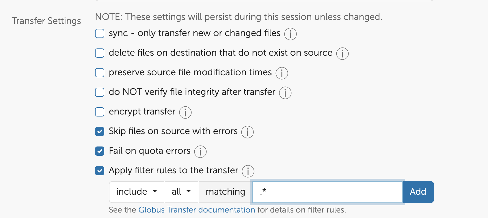

# SuperCloud to Engaging Transition Guide

Updates to SuperCloud's access policies mean that starting May 1 access to SuperCloud will be limited to Lincoln Laboratory collaborators. As ORCD expands Engaging we welcome any MIT researchers who are not Lincoln collaborators and are looking for a place to run their computational workloads. The ORCD team is here to help make that transition as smooth as possible.

This page is maintained to answer questions and document how to migrate to ORCD's Engaging system. We will continue to update this page with answers to more questions and documentation.

## Frequently Asked Questions

### What are my options?

There are other computing options available to the MIT community. ORCD runs the Engaging system which has both resources available to the entire MIT community and resources purchased by individual PIs and DLCs made available to their researchers.

Some DLCIs maintain their own set of resources. See [this page](https://orcd.mit.edu/resources/dlci-shared-hardware) for a list.

### What is the timeline?

- Through April 30: All SuperCloud users can run jobs
- Starting May 1: Running jobs limited to Lincoln Collaborators
- Through May 31: Non-collaborators may continue to access SuperCloud for data migration
- June 1: SuperCloud access limited to Lincoln Collaborators

### How do I migrate to another system?

There are three main steps or milestones for moving to a new system. These will be similar to the steps you take when getting a new account on any system.

- Transfer data: Identify what data you need to keep and transfer it to the new system. We will provide documentation on this page in the near future for recommended ways to transfer large amounts of data.
- Build any missing software: Check the software stack of the new system and see what you may need to rebuild or request. Engaging maintains a software stack through modules that includes many of the software packages provided on SuperCloud. Names may be different, so run `module avail` to check for differences.
- Run jobs: Run small tests before running larger production jobs. Both SuperCloud and Engaging use Slurm, but Engaging does not have the `LL` commands such as `LLsub`, `LLfree`, and `LLstat`. Some `sbatch` flags may differ between the two systems as well. We will provide documentation on this page in the near future for the Engaging equivalent for common SuperCloud job workflows. You can also consult the section on Running Jobs in this documentation.

### Where can I get help?

The ORCD team can help with migrating data and workloads to Engaging. ORCD has regular office hours (see the [Office Hours Schedule](https://orcd.mit.edu/news-and-events/office-hours)). You can also request help through <orcd-help@mit.edu>.

### How can I get an account on Engaging?

It is fairly quick and simple to create your account Engaging. Accounts on the engaging cluster are connected to your MIT institutional Kerberos id. To get an account log into the [Engaging OnDemand Web Portal](https://engaging-ood.mit.edu). Connecting to Engaging OnDemand for the first time automatically activates an account with basic access to resources. See [this page](accessing-orcd/ondemand-login.md) for instructions on how to log in. After you log in wait a few minutes for your account setup to complete before starting to run jobs.

### How do I know whether I have a Lincoln Collaboration?

The SuperCloud documentation on [Requesting an Account](https://mit-supercloud.github.io/supercloud-docs/requesting-account/) describes the ways to demonstration a Lincoln collaboration.

### If I have Lincoln Collaboration how do I update my account to reflect my collaboration?

Check your [User Profile page](https://txe1-portal.mit.edu/profile/user_profile.php) on the SuperCloud Web portal. The "Lincoln Laboratory Collaboration" section is in the column on the right and should list any collaborations you or your advisor/PI might have. If any collaborations are missing you can follow the instructions at the top of the page to update your information. Please indicate your collaborator status before May 1 any interruption to your ability to run jobs.

### How can I use my Python virtual environments or Conda environments on Engaging?

If you have [Python virtual environments](software/python.md#python-virtual-environments) or [Conda environments](software/python.md#conda-environments) on SuperCloud that you would like to use on Engaging, we recommend recreating them on Engaging. Simply copying over environment files is **not expected to work** due to setup differences between the two clusters.

For both types of environments, the general process is to save the environment specifications to a file to be used for regeneration on Engaging.

!!!note
    For more information on using Python on Engaging, see our
    [Python documentation](software/python.md).

#### Python virtual environments

Save contents of python venv to a `requirements.txt` file:

```bash
module load anaconda/2023b
source /path/to/my_venv/bin/activate
pip freeze > my_venv_requirements.txt
```

Transfer file to Engaging:

```bash
scp my_venv_requirements.txt <username>@orcd-login001.mit.edu:/path/to/dest
```

!!!note
    Your SuperCloud username is most likely different from your Engaging username, which is your MIT kerberos.

On Engaging, your `requirements.txt` file should now appear in the directory you specified. Recreate it with the following commands:

```bash
module load miniforge
python -m venv my_venv
source my_venv/bin/activate
pip install -r my_venv_requirements.txt
```

!!!note
    The Python version in SuperCloud's Anaconda module is different than the
    version provided by the Miniforge module on Engaging. If this is a problem,
    we recommend creating a Conda environment with your desired version of
    Python installed.

#### Conda environments

You can check all Conda environments you have created using `conda info --envs`.
As Conda environments can take up lots of space, we recommend going through and
choosing to transfer only the environments that you are still using.

For each Conda environment you'd like to transfer, take the following steps:

On SuperCloud:

```bash
module load anaconda/2023b
conda activate my_env
conda env export --no-builds | grep -v "^prefix: " > my_env.yml
```

Transfer `.yml` file to Engaging:

```bash
scp my_env.yml <username>@orcd-login001.mit.edu:/path/to/dest
```

Recreate environment on Engaging:

```bash
module load miniforge
conda env create -f my_env.yml
```

## Differences Between SuperCloud and Engaging

SuperCloud and Engaging are both shared HPC systems that use Slurm. Their high-level architecture is the same, both have login nodes and compute nodes connected by a network and filesystems that can be accessed from each node. However, there are differences in the systems, practices, and policies between the two. This section describes some of those differences that are most helpful to know.

### General Differences

- Engaging accounts can be created by anyone with an MIT kerberos, see [above](#how-can-i-get-an-account-on-engaging)
- Engaging maintenance is on the **3rd Tuesday** of each month
- Groups on Engaging are managed through Moira, once groups are created the group admins can add or remove people themselves
- Engaging can be accessed both inside and outside the United States
- Compute nodes on Engaging can access the internet
- Engaging uses an OnDemand Web Portal that provides similar functionality to the SuperCloud Web Portal

### Running Jobs

- Nodes on Engaging are not exclusive by user, one node can have multiple users running jobs.
- Engaging partitions have a different naming convention and can have multiple different types of nodes. You must specify a partition when you launch jobs. See the [Partitions section](running-jobs/overview.md#partitions) for more information.
- The wrapper commands that start with `LL` are not available on Engaging, however the Slurm commands (start with `s`, such as `sbatch`) behave similarly. See the [Running Jobs Overview page ](running-jobs/overview.md) and the [Requesting Resources page](running-jobs/requesting-resources.md).
- MIT PIs and DLCIs can purchase additional compute nodes to add to Engaging. Their groups have priority access on these nodes. The MIT community can run preemptable jobs on these nodes when they are idle through the `mit_preemptable` partition. These jobs are preempted, or stopped, when someone from the group that owns the nodes runs a job on them. If your group is interested in purchasing compute nodes reach out to <orcd-help@mit.edu>.

### Storage

- While each user on SuperCloud has a home directory, on Engaging each user has three spaces: home, pool, and scratch. Quotas on Engaging are also smaller than on SuperCloud. See [General Use Filesystems](filesystems-file-transfer/filesystems.md) for a description of each, what they are meant for, and their quotas.
- Each PI can request 5TB of shared group storage on Engaging.
- Additional storage space can be rented. See [Project Specific Filesystems](filesystems-file-transfer/project-filesystems.md) for more information and email <orcd-help@mit.edu> if you are interested in purchasing storage for your group.


## Migrating Data from SuperCloud

This section describes some recipes for migrating data from SuperCloud to Engaging, but some advice will apply to other systems.

### Step 1: What to Transfer

First, this is a good opportunity to decide what you need and what you don't need. Take a look at your home and group directories and decide what you need to keep. Transferring a lot of data (more than a few TB) or files (order of 1 million files) can take a long time. 

!!! warning "Remove files carefully"
    Remove files you no longer need very carefully. Remember, `rm` on Linux is permanent and the SuperCloud storage is not backed up!

### Step 2: Where to Transfer

Next figure out where you are going to transfer the data. ORCD has some base storage [described here](filesystems-file-transfer/filesystems.md), with additional [storage available for purchase](filesystems-file-transfer/project-filesystems.md).

Check your SuperCloud storage utilization to see how much space you use. You can see both your home directory and your group storage on your [User Profile Page](https://txe1-portal.mit.edu/profile/user_profile.php). If this is more than what the Engaging quotas can support you may want to check what you can clean up. Your group may also want to purchase additional storage.

For long-term archival storage of data that you need to keep, but will never or rarely need to access, consider purchasing archival storage such as [AWS Glacier](https://aws.amazon.com/s3/storage-classes/glacier/). For storage that you may need to access, but don't need to compute, [MIT IS&T provides some storage options](https://kb.mit.edu/confluence/display/istcontrib/Data+Storage+and+Collaboration+Options) for MIT students, staff, and faculty.

### Step 3: Transfer Your Data

If you don't have a lot of data to transfer you can use `scp` or `rsync` to transfer files at the command line. Log into either system and run your `scp` or `rsync` command from there. The best option is to do this on the download partition on SuperCloud as a batch job. You would use a batch script that looks something like this:

```bash title="transfer.sh"
#!/bin/bash

#SBATCH --partition=download

rsync -ruP path/to/source USERNAME@orcd-login001.mit.edu:/path/to/destination/supercloud-files/
```

!!! warning "Do not directly copy SuperCloud home into Engaging home"
    Be careful not to copy your SuperCloud home directory directly into your Engaging home directory. Doing so may overwrite files in your Engaging home directory, including files such as `.bashrc` which can cause issues. Instead create a subdirectory and transfer your files there.

If you have a lot of data and are having trouble with `rsync` or `scp` failing before the transfer is complete, Engaging has Globus collections that can make transfer easier. Globus will manage the file transfer for you to make sure everything transfers properly.

#### Using Globus to Transfer Data

The first step is to install Globus Connect Personal on SuperCloud. Log into SuperCloud and run the following in your home directory:

```bash
wget https://downloads.globus.org/globus-connect-personal/linux/stable/globusconnectpersonal-latest.tgz
tar xzf globusconnectpersonal-latest.tgz
cd globusconnectpersonal-x.y.z #replace x.y.z with version
./globusconnectpersonal
```

The `./globusconnectpersonal` command will walk you through setting up Globus on SuperCloud. During the process it will direct you to a link where you will be prompted to log in. Use your MIT credentials to log in. There will be a code for you to copy and enter at the command line where you ran `./globusconnectpersonal`. This will connect this installation to your account on Globus. It will also ask you for a name for your Collection, use something descriptive that you will remember (something like "My SuperCloud Collection" is sufficient). This collection will be private, other Globus users will not be able to find it.

To run Globus Connect personal use the command `./globusconnectpersonal -start`. We recommend starting Globus Connect Personal in a job on the `download` partition. This can be done with the following script:

```bash
#!/bin/bash

#SBATCH -p download

~/globusconnectpersonal-3.2.6/globusconnectpersonal -start
```

This assumes version 3.2.6 installed in your home directory.

!!! note "Copying Files in Group Directories"
    By default Globus Connect Personal will allow you to transfer files in your home directory. If you need to transfer files in a group directory you will have to specify that directory when you run `glogbusconnectpersonal -start` by adding the `-restrict-paths` flag. For example:

    ```
    globusconnectpersonal -start -restrict-paths /home/gridsan/$USER,/home/gridsan/[groupname]
    ```

To initiate the transfer go to [https://www.globus.org/](https://www.globus.org/), log in, and click "File Manager".

In the left pane search for your SuperCloud Personal collection using the name you gave it during setup. In the right pane search for the collection where you want to transfer the data:

- MIT ORCD Engaging Home Collection - For home, pool, and scratch. Use the symlinks under the "orcd" directory to get to your pool and scratch.
- MIT ORCD Engaging Data Collection - For lab purchased storage spaces
- MIT ORCD Engaging Complete Collection - Use if you cannot find your destination at the above. This collection starts at `/orcd/` on the Engaging filesystem.

If you need help finding the target directory on Engaging with Globus send an email to <orcd-help@mit.edu> or stop by [office hours]((https://orcd.mit.edu/news-and-events/office-hours)) and we can help you.

Once you have selected your target collection navigate to the directory where you want to transfer your data. Create a directory called "SuperCloud" and select it.

Select the items you want to transfer from SuperCloud in the left pane, or "Select all" to transfer your entire home directory. Symlinks (to group directories) and their contents are not transferred.

!!! hint "Deselect dot . files"
    Click "Show Hidden Items" to deselect . files. Your .bashrc and any conda environments will not work on another system and could cause issues.


Under Transfer and Timer options select:

- Skip files on source with errors
- Fail on quota errors
- Encrypt transfer
- Consider:
    - Excluding dot files (ex: .bashrc). Check "Apply filter rules to the transfer" and set to exclude all matching `.*` (see screenshot below)
    - Sync, This is helpful if you've already transferred files and only want to transfer new files



Once you have selected your source files, destination, and transfer settings click the "Start" button on the left pane (the SuperCloud side). You can view the transfer progress on the "Activity" page, and Globus will send you an email when the transfer is done.

If Globus Connect Personal stops on SuperCloud, for example if the job ends, restart it in the same way and Globus should continue the transfer where it left off.